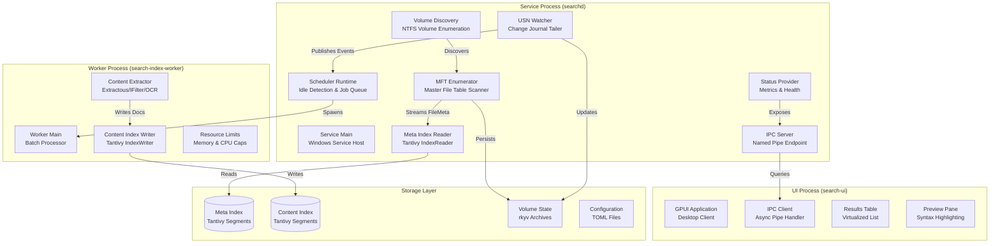
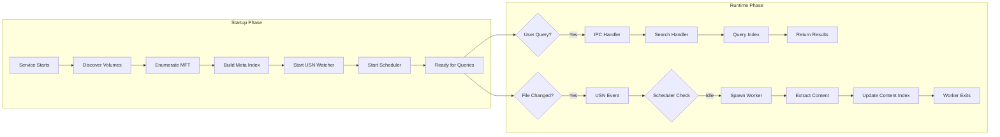
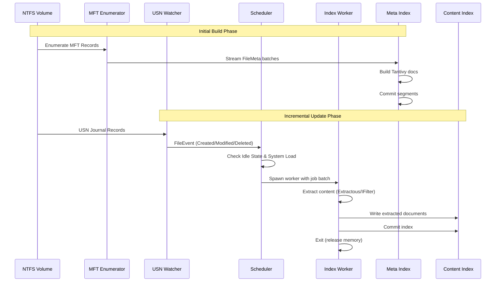
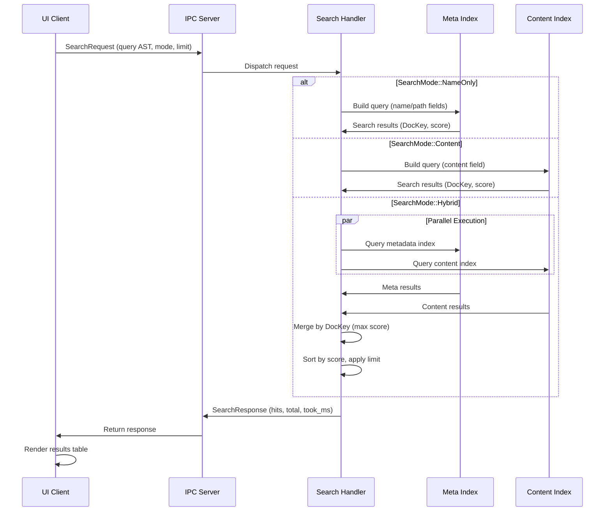
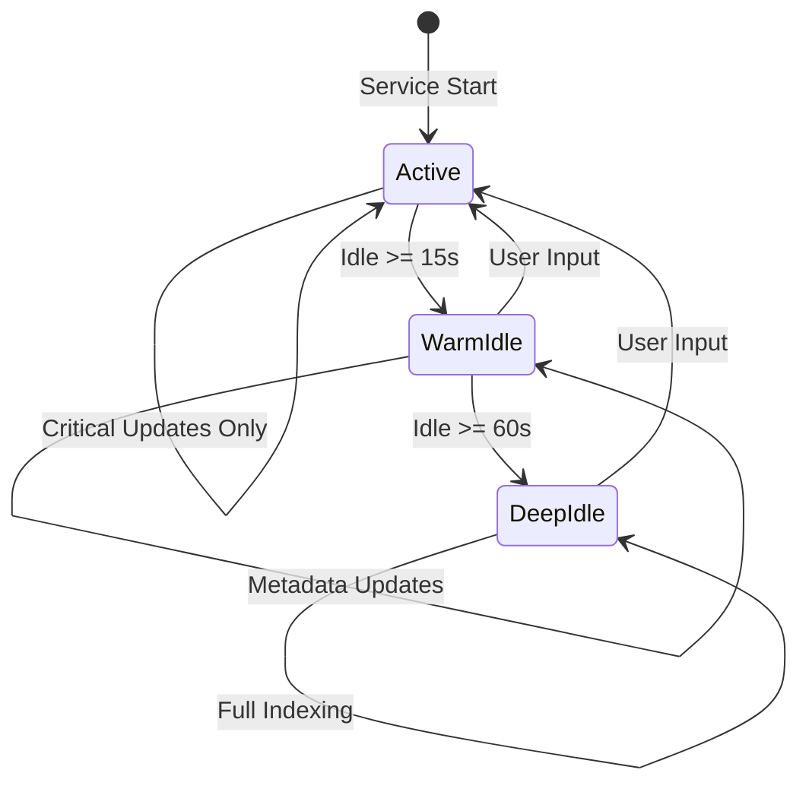

# UltraSearch

[](https://www.rust-lang.org/)
[](LICENSE)
[](https://github.com/Dicklesworthstone/ultrasearch)
[](https://doc.rust-lang.org/edition-guide/rust-2024/index.html)

> **A high-performance, memory-efficient desktop search engine for Windows that combines NTFS MFT enumeration with full-text content indexing. Built entirely in Rust, UltraSearch provides Everything-style instant filename search alongside deep content search capabilities, all while maintaining a minimal memory footprint through careful architectural decisions.**

UltraSearch represents a fundamental rethinking of desktop search architecture. Rather than treating search as a monolithic application, it decomposes the problem into specialized components that work together seamlessly: a lightweight always-on service for metadata queries, isolated worker processes for resource-intensive content extraction, and a modern GPU-accelerated UI that feels instant.

## Purpose and Motivation

Desktop search tools have historically forced users into a false dichotomy: choose speed or comprehensiveness. UltraSearch eliminates this trade-off by leveraging modern systems programming techniques and Windows-specific optimizations.

### The Problem Space

**Windows Search** provides comprehensive content indexing but suffers from fundamental architectural limitations:
* Slow initial builds requiring hours or days for large filesystems
* High memory usage (hundreds of megabytes resident) even when idle
* Intrusive background activity that impacts system responsiveness
* Opaque indexing state making troubleshooting difficult
* Limited query expressiveness and ranking control

**Everything** demonstrates that instant filename search is achievable:
* Sub-10ms query latency even on filesystems with millions of files
* Minimal memory footprint (tens of megabytes)
* Real-time change detection via USN journal
* However, it lacks content indexing capabilities entirely

**Recursive directory crawlers** (used by many search tools) are fundamentally flawed:
* Must traverse directory trees, opening handles and reading metadata
* Cannot leverage NTFS's efficient MFT structure
* Miss files inaccessible via normal directory APIs
* Scale poorly: O(n) complexity where n is directory depth

### UltraSearch's Approach

UltraSearch bridges these gaps through architectural innovation:

1. **NTFS-Native Indexing**: Direct MFT enumeration eliminates recursive traversal overhead, achieving 100k-1M files/second indexing rates
2. **Process Isolation**: Heavy extraction work occurs in short-lived worker processes that exit immediately after completion, keeping the service lightweight
3. **Unified Search Engine**: Both metadata and content queries use Tantivy, providing consistent ranking and query expressiveness
4. **Intelligent Scheduling**: Background indexing respects user activity and system load, remaining invisible during normal use
5. **Memory Efficiency**: Memory-mapped storage, zero-copy serialization, and bounded allocations ensure predictable resource usage

The result is a search system that feels instant for filename queries while providing comprehensive content search, all running as a background service that consumes minimal resources.

## Architecture Overview

UltraSearch follows a multi-process architecture designed to isolate resource-intensive operations from the always-on service. This separation ensures the service remains lightweight while allowing heavy extraction and indexing work to occur in isolated worker processes.

### High-Level Process Architecture



### Component Interaction Diagram



### Data Flow: Indexing Pipeline



### Query Execution Flow



### Scheduler State Machine



## Core Data Model

UltraSearch's data model is designed around efficient storage, fast queries, and cross-index correlation. Every design decision prioritizes memory efficiency and query performance.

### Identifier System

The identifier hierarchy enables efficient storage while maintaining the ability to correlate documents across multiple indices.

#### VolumeId (u16)

A small integer assigned at runtime that maps to volume GUID paths and drive letters.

```
┌─────────────────────────────────────────────────────────┐
│ VolumeId: u16                                           │
├─────────────────────────────────────────────────────────┤
│ Range: 0..65535                                         │
│ Assignment: Sequential at service startup              │
│ Persistence: Stored in volume state files              │
│ Use Cases: Per-volume filtering, isolation              │
└─────────────────────────────────────────────────────────┘
```

**Design Rationale**: 
* 16 bits provides 65,535 possible volumes, far exceeding practical needs
* Small size enables efficient packing into composite keys
* Sequential assignment simplifies volume management
* Runtime assignment allows dynamic volume discovery

#### FileId (u64)

The 64-bit NTFS File Reference Number (FRN) from the MFT.

```
┌─────────────────────────────────────────────────────────┐
│ FileId: u64                                             │
├─────────────────────────────────────────────────────────┤
│ Bits 0-47:  File Reference Number (FRN)                │
│ Bits 48-63: Sequence Number                            │
│ Stability: Persists across renames (same volume)       │
│ Detection: Sequence number detects stale references    │
└─────────────────────────────────────────────────────────┘
```

**Design Rationale**:
* FRN is NTFS's native file identifier, providing direct MFT access
* Sequence number enables detection of deleted/reused file entries
* 48-bit FRN supports 281 trillion files per volume (practical limit: ~4 billion)
* Stable across renames enables efficient index updates

#### DocKey (u64)

Composite key packing VolumeId and FileId into a single 64-bit value.

```
┌─────────────────────────────────────────────────────────┐
│ DocKey: u64                                             │
├─────────────────────────────────────────────────────────┤
│ Bits 0-47:  FileId (FRN + sequence)                    │
│ Bits 48-63: VolumeId                                   │
│ Format: "{volume}:0x{frn_hex}"                        │
│ Use: Primary key for all index operations               │
└─────────────────────────────────────────────────────────┘
```

**Implementation**:
```rust
impl DocKey {
    pub const fn from_parts(volume: VolumeId, file: FileId) -> Self {
        let packed = ((volume as u64) << 48) | (file & 0x0000_FFFF_FFFF_FFFF);
        DocKey(packed)
    }
    
    pub const fn into_parts(self) -> (VolumeId, FileId) {
        let volume = (self.0 >> 48) as VolumeId;
        let file = self.0 & 0x0000_FFFF_FFFF_FFFF;
        (volume, file)
    }
}
```

**Design Rationale**:
* Single 64-bit value enables efficient storage and comparison
* Fast field support in Tantivy enables per-volume filtering without document retrieval
* Human-readable format aids debugging and logging
* Enables efficient range queries for volume-based operations

**Trade-offs Considered**:
* **Separate fields**: Rejected due to increased storage overhead and query complexity
* **String-based keys**: Rejected due to memory overhead and comparison cost
* **128-bit UUIDs**: Rejected due to storage overhead and lack of volume locality

### Document Types

UltraSearch maintains two distinct index types with different schemas and update frequencies. This separation is fundamental to the architecture.

#### Metadata Documents (meta-index)

Optimized for filename and attribute queries with minimal storage overhead.

```
┌─────────────────────────────────────────────────────────┐
│ Metadata Document Schema                                │
├─────────────────────────────────────────────────────────┤
│ doc_key:    u64  FAST + STORED  Primary key            │
│ volume:     u16  FAST           Per-volume filtering   │
│ name:       TEXT Indexed         Filename search        │
│ path:       TEXT Indexed         Path search            │
│ ext:        STRING FAST          Extension filter       │
│ size:       u64  FAST            Size range queries    │
│ created:    i64  FAST            Creation time          │
│ modified:   i64  FAST            Modification time      │
│ flags:      u64  FAST            Attribute bitfield    │
└─────────────────────────────────────────────────────────┘
```

**Field Details**:

* **doc_key**: Primary key enabling efficient delete/update operations. Stored as fast field for filtering without document retrieval.
* **volume**: Enables per-volume query filtering using fast field lookups. Critical for multi-volume systems.
* **name**: Tokenized with separators `[\ / . - _]` to support partial matching. Analyzer tuned for filename patterns.
* **path**: Optional field; can be reconstructed from directory tree or stored for convenience. Tokenized by directory separators.
* **ext**: Keyword field enabling exact extension matching. Fast field for efficient filtering.
* **size**: Enables range queries for file size filtering. Stored as u64 to support files up to 16 exabytes.
* **created/modified**: Unix timestamps (seconds) enabling time-range queries. Fast fields for efficient filtering.
* **flags**: Bitfield encoding file attributes:
  * `IS_DIR`: Directory flag
  * `HIDDEN`: Hidden file attribute
  * `SYSTEM`: System file attribute
  * `ARCHIVE`: Archive bit
  * `REPARSE`: Reparse point (symlink/junction)
  * `OFFLINE`: Offline file
  * `TEMPORARY`: Temporary file

**Typical Document Size**: 100-500 bytes per file (depends on path length)

**Update Frequency**: Immediate on file system changes via USN journal

#### Content Documents (content-index)

Full-text content extracted from files, updated only during background indexing.

```
┌─────────────────────────────────────────────────────────┐
│ Content Document Schema                                 │
├─────────────────────────────────────────────────────────┤
│ doc_key:      u64  FAST + STORED  Correlates with meta │
│ volume:       u16  FAST            Per-volume filtering │
│ name:         TEXT Indexed         Name boost           │
│ path:         TEXT STORED          Snippet context     │
│ ext:          STRING FAST          Format filter        │
│ size:         u64  FAST            Size filter         │
│ modified:     i64  FAST            Recency boost        │
│ content_lang: STRING STORED        Analyzer selection   │
│ content:      TEXT Indexed         Full-text search     │
└─────────────────────────────────────────────────────────┘
```

**Field Details**:

* **doc_key**: Correlates with metadata index, enabling result merging and metadata lookup
* **content**: Main full-text field with default English analyzer (tokenization + stopwords + stemming)
* **content_lang**: Language code (ISO 639-1) for analyzer selection. Enables per-language tokenization.
* **name/path**: Included for ranking boost; name matches weighted higher than content matches

**Typical Document Size**: Varies widely (truncated at configurable limits: 16-32 MiB, 100-200k chars)

**Update Frequency**: Only during background indexing when system is idle

### Why Separate Indices?

This architectural decision is fundamental to UltraSearch's efficiency. Several alternatives were considered:

**Alternative 1: Single Unified Index**
* **Pros**: Simpler architecture, single query path
* **Cons**: 
  * Content updates require touching large index
  * Service must hold content index reader (memory overhead)
  * Cannot disable content indexing without affecting metadata
* **Verdict**: Rejected due to memory and update frequency mismatches

**Alternative 2: Three Indices (Meta, Content, Combined)**
* **Pros**: Flexibility in query routing
* **Cons**: 
  * Data duplication increases storage overhead
  * Consistency challenges across three indices
  * Increased complexity in update logic
* **Verdict**: Rejected due to complexity and storage overhead

**Chosen Approach: Two Separate Indices**

**Benefits**:
1. **Update Frequency Mismatch**: Metadata changes frequently (renames, moves, attribute changes) while content changes less often. Separating them allows metadata updates without touching the larger content index.
2. **Query Patterns**: Filename searches are far more common than content searches. Keeping metadata separate enables faster queries for the common case.
3. **Memory Footprint**: The service can operate with only the metadata index loaded, keeping memory usage minimal. Content index is opened only when needed for content queries.
4. **Indexing Strategy**: Content extraction is resource-intensive and runs in separate worker processes. Metadata indexing is lightweight and can run in the service process.
5. **Failure Isolation**: Corruption or issues with content index don't affect metadata search capabilities.

**Trade-offs**:
* **Result Merging**: Hybrid queries require merging results from both indices. This adds complexity but enables optimal query routing.
* **Consistency**: Two indices can theoretically diverge. Mitigated by using DocKey as correlation key and atomic updates per index.

## NTFS Integration

UltraSearch leverages Windows NTFS primitives directly rather than recursive directory traversal. This approach provides several fundamental advantages that cannot be achieved through traditional file system APIs.

### Volume Discovery

The volume discovery process runs at service startup and whenever volumes are added or removed. It uses Windows volume enumeration APIs to identify NTFS volumes.

**Process Flow**:

```rust
// Simplified discovery algorithm
1. GetLogicalDrives() → enumerate drive letters
2. For each drive:
   a. GetVolumeInformationW() → check filesystem type
   b. Filter to NTFS volumes only
   c. GetVolumeNameForVolumeMountPointW() → resolve GUID path
   d. Map drive letters to volume GUIDs
3. Assign VolumeId sequentially
4. Store mapping in persistent state
```

**Design Decision: Volume GUID Paths vs Drive Letters**

We use volume GUID paths (`\\?\Volume{...}\`) rather than drive letters because:

* **Stability**: GUIDs persist across reboots and drive letter reassignments
* **Mount Points**: Multiple drive letters can map to the same volume (mount points)
* **No Drive Letter**: Volumes can exist without assigned drive letters
* **Uniqueness**: GUIDs are globally unique, eliminating ambiguity

**Example Volume Mapping**:
```
VolumeId: 1
GUID Path: \\?\Volume{12345678-1234-1234-1234-123456789abc}\
Drive Letters: ["C:", "D:"]
```

### MFT Enumeration

The Master File Table (MFT) is NTFS's core data structure containing metadata for every file and directory. UltraSearch uses `usn-journal-rs` to enumerate MFT records efficiently.

**MFT Structure** (simplified):
```
┌─────────────────────────────────────────────────────────┐
│ MFT Record (1024 bytes typical)                        │
├─────────────────────────────────────────────────────────┤
│ Header: Record number, sequence, flags                  │
│ Attributes:                                             │
│   - $STANDARD_INFORMATION: Timestamps, attributes       │
│   - $FILE_NAME: Filename, parent FRN                   │
│   - $DATA: File content (or stream info)                │
│   - $BITMAP: Allocation status                         │
└─────────────────────────────────────────────────────────┘
```

**Enumeration Process**:

1. **Open Volume Handle**: 
   ```rust
   CreateFileW(
       volume_guid_path,
       FILE_READ_ATTRIBUTES | FILE_READ_DATA | FILE_LIST_DIRECTORY,
       FILE_SHARE_READ | FILE_SHARE_WRITE | FILE_SHARE_DELETE,
       ...
   )
   ```

2. **Iterate MFT Records**:
   * Use `usn-journal-rs` iterator to enumerate records
   * For each record:
     * Extract File Reference Number (FRN), parent FRN
     * Extract file name, flags, size, timestamps
     * Filter out inaccessible system files (configurable patterns)
     * Resolve FRN to full path using `usn-journal-rs` utilities

3. **Stream to Index Builder**:
   * Construct `FileMeta` from MFT record
   * Stream directly to metadata index builder (no buffering)
   * Periodic commits (every 100k docs or 30s) ensure progress

**Performance Characteristics**:

* **Enumeration Rate**: 100k-1M files/second (depends on disk speed and MFT fragmentation)
* **Memory Usage**: Minimal; streaming approach avoids buffering entire filesystem
* **Path Resolution**: On-demand using `usn-journal-rs` utilities; small LRU cache for acceleration

**Why MFT Enumeration Over Directory Traversal?**

| Approach | Complexity | Speed | Completeness | Memory |
|----------|-----------|-------|--------------|--------|
| **MFT Enumeration** | O(n) where n = files | 100k-1M files/s | Complete (includes inaccessible files) | Minimal (streaming) |
| **Directory Traversal** | O(n × d) where d = depth | 1k-10k files/s | Incomplete (misses inaccessible) | High (directory tree) |

**Trade-offs**:
* **Pros**: Orders of magnitude faster, complete coverage, minimal memory
* **Cons**: Requires elevated privileges, Windows-specific, more complex error handling

### USN Journal Tailing

The Update Sequence Number (USN) Change Journal tracks all file system changes. UltraSearch tails this journal to detect changes incrementally without rescanning.

**USN Journal Structure**:

```
┌─────────────────────────────────────────────────────────┐
│ USN Journal Data                                        │
├─────────────────────────────────────────────────────────┤
│ UsnJournalID:     Unique journal identifier            │
│ FirstUsn:         Oldest record in journal            │
│ NextUsn:          Next USN to be assigned              │
│ LowestValidUsn:    Oldest valid USN                    │
│ MaxUsn:           Maximum USN value                    │
└─────────────────────────────────────────────────────────┘
```

**Architecture**:

* Per-volume worker thread in service process
* Opens journal via `CreateFileW` on volume GUID path
* Uses `FSCTL_QUERY_USN_JOURNAL` and `FSCTL_READ_USN_JOURNAL` (encapsulated by `usn-journal-rs`)
* Maintains `last_usn` and `journal_id` per volume in persistent state files

**Change Event Types**:

```rust
pub enum FileEvent {
    Created { usn: u64, frn: u64, name: String, parent_frn: u64 },
    Deleted { usn: u64, frn: u64 },
    Modified { usn: u64, frn: u64 },
    Renamed { usn: u64, frn: u64, old_name: String, new_name: String, parent_frn: u64 },
    BasicInfoChanged { usn: u64, frn: u64 }, // Attributes, timestamps, permissions
}
```

**Change Gap Handling**:

On startup, compare stored `journal_id` and `last_usn` with current journal state:

* **Journal Wrap**: If `last_usn` lies outside `[FirstUsn, NextUsn]`, journal has wrapped
* **Journal Recreate**: If `journal_id` changed, journal was recreated (volume reformatted)
* **Recovery**: In either case, mark volume as stale and schedule incremental MFT walkthrough

**Why USN Journal Over File System Watchers?**

| Feature | USN Journal | ReadDirectoryChangesW |
|---------|-------------|---------------------|
| **Completeness** | Complete change history | Buffer overflow risk |
| **Persistence** | Survives reboots | Lost on service restart |
| **Performance** | Single volume handle | Per-directory handles |
| **Reliability** | No buffer overflows | Buffer overflow issues |
| **Coverage** | All changes | Only watched directories |

**Design Rationale**:
* File system watchers (`ReadDirectoryChangesW`) have fundamental limitations:
  * Buffer overflow issues with high change rates
  * Miss changes during service downtime
  * Require maintaining directory handles
* USN journal provides complete, reliable change history
* No buffer overflows; journal persists across reboots
* Single volume handle instead of per-directory handles

## Indexing Architecture

UltraSearch uses Tantivy 0.24.x as its search engine, chosen after evaluating several alternatives. The decision was driven by performance, memory efficiency, and Rust-native implementation.

### Why Tantivy?

**Evaluation Matrix**:

| Engine | Language | Performance | Memory | Rust Integration | Maintenance |
|--------|----------|-------------|--------|------------------|-------------|
| **Tantivy** | Rust | Excellent | Efficient | Native | Active |
| Lucene | Java | Excellent | Higher | FFI required | Active |
| Bleve | Go | Good | Moderate | FFI required | Active |
| Meilisearch | Rust | Good | Higher | Native | Active |

**Decision Factors**:

1. **Rust-Native**: No FFI overhead, better memory safety guarantees, seamless integration
2. **Performance**: Competitive with or faster than Lucene in benchmarks
3. **Memory Efficiency**: CompactDoc format reduces memory usage significantly
4. **Active Development**: Well-maintained with modern Rust best practices
5. **Feature Completeness**: Supports all required query types and indexing strategies

### Tantivy Index Schema

Both metadata and content indices use Tantivy 0.24.x with CompactDoc format for memory efficiency.

#### Metadata Index Schema

```rust
// Field definitions with indexing options
doc_key: u64      // FAST | STORED  (primary key for delete/update)
volume: u16       // FAST            (per-volume query filtering)
name: TEXT        // Indexed with tokenizer supporting [\ / . - _]
path: TEXT        // Optional; can be reconstructed or stored
ext: STRING       // Keyword field, FAST (exact extension matching)
size: u64         // FAST            (range queries for file size filtering)
created: i64      // FAST            (timestamp range queries)
modified: i64     // FAST            (timestamp range queries)
flags: u64        // FAST            (bitfield: is_dir, hidden, system, etc.)
```

**Field Type Rationale**:

* **FAST fields**: Stored in columnar format, enabling efficient range queries and filtering without document retrieval. Critical for performance.
* **STORED fields**: Available for retrieval without re-reading index segments. Used for primary keys and frequently accessed metadata.
* **TEXT fields**: Tokenized and indexed for full-text search. Analyzer tuned for filename patterns.
* **STRING fields**: Stored as-is, enabling exact matching (e.g., file extensions).

**Tokenization Strategy**:

The `name` field uses a custom tokenizer that splits on common filename separators:

```
Input:  "my-document_v2.pdf"
Tokens: ["my", "document", "v2", "pdf", "my-document_v2.pdf"]
```

This enables:
* Prefix matching: `"my"` matches `"my-document"`
* Partial matching: `"doc"` matches `"document"`
* Exact matching: Full filename still indexed

#### Content Index Schema

```rust
doc_key: u64           // FAST | STORED  (correlates with metadata index)
volume: u16            // FAST
name: TEXT              // Optional; factored into ranking
path: TEXT              // Stored for snippet context
ext: STRING             // FAST
size: u64               // FAST
modified: i64           // FAST
content_lang: STRING    // Language code for analyzer selection
content: TEXT           // Main full-text field with default English analyzer
```

**Analyzer Strategy**:

* **Default Analyzer**: English (tokenization + stopwords + stemming)
* **Per-Language Analyzers**: Selected based on `content_lang` field
* **Future Enhancement**: Document-type-aware analyzers (code, logs, documents)

### Memory Management Strategy

UltraSearch employs several strategies to maintain predictable memory usage, critical for a background service.

#### Memory-Mapped Storage

Large datasets use memory-mapped storage via `memmap2`:

```rust
use memmap2::{Mmap, MmapOptions};
use std::fs::File;

pub struct MappedIndex {
    mmap: Mmap,
    // ... index metadata
}

impl MappedIndex {
    pub fn from_file(path: &Path) -> Result<Self> {
        let file = File::open(path)?;
        let mmap = unsafe { MmapOptions::new().map(&file)? };
        Ok(Self { mmap })
    }
}
```

**Benefits**:
* Leverages OS page cache for frequently accessed data
* Zero-copy reads where possible
* Memory usage scales with working set, not total dataset size
* Automatic eviction by OS when memory pressure occurs

**Trade-offs**:
* Initial mapping overhead (negligible for typical use)
* OS-dependent behavior (generally well-optimized)

#### Zero-Copy Serialization

Metadata snapshots and volume state files use `rkyv` for zero-copy deserialization:

```rust
use rkyv::{Archive, Deserialize, Serialize};

#[derive(Archive, Serialize, Deserialize)]
pub struct VolumeState {
    pub volume_id: VolumeId,
    pub last_usn: u64,
    pub journal_id: u64,
    // ...
}

// Serialization
let bytes = rkyv::to_bytes::<_, 256>(&state)?;

// Zero-copy deserialization
let archived = unsafe { rkyv::archived_root::<VolumeState>(&bytes[..]) };
let state: &VolumeState = archived.deserialize(&mut Infallible)?;
```

**Performance Characteristics**:
* **Size**: 2-5x smaller than JSON
* **Speed**: 10-100x faster deserialization
* **Memory**: Zero-copy access without deserialization overhead

#### Index Writer Isolation

Content index writer exists only in worker process:

**Configuration**:
```rust
let writer_config = WriterConfig {
    heap_size: 64 * 1024 * 1024,  // 64 MB heap
    num_threads: 2,                 // Parallel indexing
    // ...
};
let writer = index.writer_with_config(writer_config)?;
```

**Benefits**:
* Worker exits immediately after commit, releasing all allocations
* Service never holds writer-specific state
* Bounded memory usage per worker
* Multiple workers can run concurrently without exhausting memory

**Trade-offs**:
* More frequent commits and merges
* Worker spawn overhead (mitigated by batching)

#### Reader Configuration

Service maintains lightweight IndexReader instances:

```rust
let reader = index
    .reader_builder()
    .reload_policy(ReloadPolicy::Manual)  // Avoid unnecessary reloads
    .num_warmers(0)                        // Minimal warmup
    .docstore_cache_size(10 * 1024 * 1024) // 10 MB cache
    .build()?;
```

**Configuration Rationale**:
* **Manual Reload Policy**: Avoids unnecessary reloads; service controls when to refresh
* **Zero Warmers**: Reduces startup overhead; OS page cache handles frequently accessed segments
* **Small Cache**: Minimal in-process cache; relies on OS page cache for bulk data

### Index Writer Tuning

Tantivy index writers are configured differently for metadata and content indices based on their usage patterns.

#### Metadata Index Writer

Used only during initial build and rare rebuilds:

```rust
WriterConfig {
    heap_size: 512 * 1024 * 1024,  // 512 MB (if machine has RAM)
    num_threads: min(8, num_cpus()), // Parallel indexing
    merge_policy: LogMergePolicy {
        target_segment_size: 256 * 1024 * 1024,  // 256 MB segments
        max_merged_segment_size: 1024 * 1024 * 1024,  // 1 GB max
    },
}
```

**Rationale**:
* Large heap enables efficient batching during initial build
* Parallel indexing leverages multiple CPU cores
* Larger segments reduce merge frequency

#### Content Index Writer

Used in worker processes with bounded memory:

```rust
WriterConfig {
    heap_size: 64 * 1024 * 1024,   // 64-256 MB (configurable)
    num_threads: 2,                  // 2-4 threads
    merge_policy: LogMergePolicy {
        target_segment_size: 128 * 1024 * 1024,  // 128 MB segments
        max_merged_segment_size: 256 * 1024 * 1024,  // 256 MB max
    },
}
```

**Rationale**:
* Bounded heap prevents worker from consuming excessive memory
* Fewer threads reduce contention and memory spikes
* Smaller segments enable more frequent commits

**Why Bounded Heap Size?**

* **Prevents Memory Exhaustion**: Worker process cannot consume excessive memory
* **Concurrent Workers**: Multiple workers can run without exhausting system memory
* **Predictable Behavior**: Memory usage remains within configured bounds
* **Trade-off**: More frequent commits and merges, but predictable memory usage

## Content Extraction

UltraSearch supports multiple extraction backends with automatic fallback. The extraction system is designed to handle a wide variety of file formats while maintaining low memory usage.

### Extractor Architecture

The extraction system uses a trait-based design with ordered fallback:

```rust
pub trait Extractor: Send + Sync {
    fn name(&self) -> &'static str;
    fn supports(&self, ctx: &ExtractContext) -> bool;
    fn extract(&self, ctx: &ExtractContext, key: DocKey) -> Result<ExtractedContent>;
}

pub struct ExtractorStack {
    backends: Vec<Box<dyn Extractor + Send + Sync>>,
}
```

**Extraction Flow**:

1. Iterate through extractor stack in order
2. First extractor that claims support (`supports()` returns true) handles the file
3. If extraction fails, error is returned (no fallback to next extractor)
4. Result includes text, language hints, truncation flag, and bytes processed

**Why Ordered Fallback?**

* **Performance**: Try fastest extractors first (SimpleText before Extractous)
* **Specificity**: More specific extractors (IFilter for Office) before general ones
* **Resource Usage**: Lightweight extractors before resource-intensive ones

### Extractous Integration

Extractous is the primary extraction engine, providing support for Apache Tika formats.

**Supported Formats**:

* **Documents**: PDF, Word (docx), Excel (xlsx), PowerPoint (pptx), RTF
* **Web**: HTML, XML, XHTML
* **Archives**: ZIP (with format whitelist)
* **Data**: CSV, JSON, JSONL
* **E-books**: EPUB
* **Markup**: Markdown, reStructuredText

**Performance Characteristics**:

* **Speed**: 10-18x speedups vs Python alternatives in benchmarks
* **Memory**: ~11x lower memory usage compared to some alternatives
* **Implementation**: Internal use of Tika bits with GraalVM, but exposed as safe Rust APIs

**Usage Pattern**:

```rust
let engine = ExtractousEngine::new()
    .set_extract_string_max_length(max_chars as i32);
let (text, metadata) = engine.extract_file_to_string(path)?;
```

**Why Extractous Over Alternatives?**

| Engine | Language | Formats | Performance | Memory | Maintenance |
|--------|----------|---------|-------------|--------|-------------|
| **Extractous** | Rust | Tika-compatible | Excellent | Low | Active |
| Apache Tika | Java | Comprehensive | Good | Higher | Active |
| python-docx | Python | Limited | Moderate | Moderate | Active |
| LibreOffice | C++ | Office | Good | Higher | Active |

**Decision Factors**:
* **Rust-Native**: No FFI overhead, better memory safety
* **Format Coverage**: Apache Tika compatibility provides wide format support
* **Performance**: Significantly faster than Python-based alternatives
* **Memory Efficiency**: Lower memory usage than many alternatives

### IFilter COM Integration (Optional)

Windows COM IFilter interface provides access to system-installed filters:

**When Used**:
* File types Extractous doesn't support
* System-installed filters with better fidelity (e.g., proprietary Office formats)
* Fallback when Extractous extraction fails

**Implementation**:

```rust
#[cfg(windows)]
use windows::Win32::System::Com::{IPersistFile, IFilter};

pub struct IFilterExtractor {
    // COM interface wrappers
}

impl Extractor for IFilterExtractor {
    fn extract(&self, ctx: &ExtractContext, key: DocKey) -> Result<ExtractedContent> {
        let filter = LoadIFilter(ctx.path)?;
        // Iterate chunks via GetChunk/GetText
        // ...
    }
}
```

**Trade-offs**:
* **Pros**: Access to system-installed filters, better compatibility
* **Cons**: COM overhead, STA thread requirements, platform-specific
* **Decision**: Gated behind feature flag due to COM/STA requirements

### OCR Integration

For scanned PDFs and images, UltraSearch integrates Tesseract OCR:

**Detection Strategy**:
* Detect if document is image-only (no text from Extractous)
* Run Tesseract on each page up to configurable limit
* Merge recognized text and mark `content_lang` field

**Implementation**:

```rust
pub struct OCRExtractor {
    engine: TesseractEngine,
    max_pages: u64,
}

impl Extractor for OCRExtractor {
    fn extract(&self, ctx: &ExtractContext, key: DocKey) -> Result<ExtractedContent> {
        if self.is_image_only(ctx.path)? {
            let text = self.engine.extract_pages(ctx.path, self.max_pages)?;
            Ok(ExtractedContent {
                text,
                content_lang: Some(self.engine.detect_language(&text)?),
                // ...
            })
        } else {
            Err(ExtractError::Unsupported("not image-only".into()))
        }
    }
}
```

**Resource Limits**:
* Configurable per-document type limits
* Can disable OCR entirely via configuration
* Respects overall `max_chars` limit

### Resource Limits and Streaming

To maintain low memory usage, UltraSearch enforces strict limits:

**Document Limits**:
* `max_bytes_per_file`: 16-32 MiB default (configurable)
* `max_chars`: 100-200k characters per document
* Truncation occurs at character boundaries to avoid corrupting UTF-8

**Archive Policies**:
* Only index whitelisted formats inside ZIPs
* Limit recursion depth
* Skip encrypted archives

**Streaming Extraction**:
* Where Extractous or backends support it, stream pages instead of concatenating
* Use `String` buffers per file with reserved capacity up to `max_chars`
* Beyond limit, discard remainder or treat as truncated

**Why These Limits?**

* **Prevents Memory Exhaustion**: Worker process cannot consume excessive memory
* **Large Documents**: Rarely need full content indexed (user can open file for details)
* **Trade-off**: Some content may be truncated, but memory usage remains predictable

## Scheduler and Background Execution

The scheduler implements intelligent resource-aware job execution. This ensures indexing occurs only when the system can spare resources, preventing interference with user activity.

### Idle Detection

UltraSearch uses Windows `GetLastInputInfo` API to detect user activity:

**Implementation**:

```rust
pub struct IdleTracker {
    warm_idle: Duration,
    deep_idle: Duration,
    // ...
}

impl IdleTracker {
    pub fn sample(&mut self) -> IdleSample {
        let idle_for = self.get_idle_duration()?;
        let state = self.classify_idle(idle_for);
        IdleSample { state, idle_for, since_state_change }
    }
    
    fn get_idle_duration(&self) -> Option<Duration> {
        #[cfg(windows)]
        {
            let last_input = GetLastInputInfo()?;
            let now = GetTickCount64();
            Some(Duration::from_millis((now - last_input) as u64))
        }
    }
}
```

**State Machine**:

```
┌─────────────────────────────────────────────────────────┐
│ Idle State Classification                               │
├─────────────────────────────────────────────────────────┤
│ Active:    idle < 15 seconds                            │
│ WarmIdle:  15-60 seconds                                │
│ DeepIdle:  > 60 seconds                                 │
└─────────────────────────────────────────────────────────┘
```

**Why These Thresholds?**

* **15 seconds**: User may be reading or thinking, but likely to interact soon
* **60 seconds**: User is likely away or deeply focused on another task
* **Configurable**: Per-user preferences can adjust thresholds

**Alternative Approaches Considered**:

* **PROCESS_MODE_BACKGROUND_BEGIN**: Rejected due to working-set clamp causing severe paging
* **CPU-only detection**: Insufficient; user may be idle but system busy with other tasks
* **Screen saver detection**: Too coarse-grained, doesn't account for video playback

### System Load Sampling

UltraSearch monitors system resources using `sysinfo` crate:

**Metrics Collected**:

```rust
pub struct SystemLoad {
    pub cpu_percent: f32,           // CPU usage percentage
    pub mem_used_percent: f32,      // Memory usage percentage
    pub disk_busy: bool,            // Disk I/O threshold exceeded
    pub disk_bytes_per_sec: u64,    // Disk I/O rate
    pub sample_duration: Duration,  // Sampling window
}
```

**Thresholds**:

```
┌─────────────────────────────────────────────────────────┐
│ System Load Thresholds                                  │
├─────────────────────────────────────────────────────────┤
│ CPU < 20%:   Content indexing allowed in DeepIdle      │
│ CPU 20-50%:  Metadata updates only                     │
│ CPU > 50%:   Pause all indexing                        │
│ Disk Busy:   Flagged when I/O exceeds baseline        │
└─────────────────────────────────────────────────────────┘
```

**Why These Thresholds?**

* **20% CPU**: Leaves headroom for user applications and system processes
* **50% CPU**: System is clearly busy; indexing would cause noticeable slowdown
* **Disk I/O Monitoring**: Prevents indexing from interfering with user file operations

**Windows-Specific Implementation**:

```rust
#[cfg(windows)]
fn sample_disk_io() -> Result<u64> {
    use windows::Win32::System::Performance::*;
    // Use PDH API: \\PhysicalDisk(_Total)\\Disk Bytes/sec
    // ...
}
```

### Job Categories and Priorities

Jobs are categorized by resource requirements:

**Critical Updates** (cheap):
* Deletion events, simple renames, attribute changes
* Processed quickly even in Active state
* Minimal resource usage (< 1ms per event)

**Metadata Rebuilds** (moderate):
* Volume rescan after USN gap
* Directory tree reindex after config change
* Only in WarmIdle or better
* Typical duration: seconds to minutes

**Content Indexing** (heavy):
* New or changed files requiring full extraction
* Only in DeepIdle with low CPU/disk thresholds
* Batched into worker processes
* Typical duration: minutes to hours

**Scheduler Algorithm**:

```rust
pub async fn tick(&mut self) {
    let idle_sample = self.idle.sample();
    let load = self.load.sample();
    
    // Update status
    self.update_status(idle_sample, load);
    
    // Gate jobs on policies
    let allow_content = self.allow_content_jobs(idle_sample, load);
    
    if allow_content && !self.content_jobs.is_empty() {
        let batch = self.pop_batch(self.config.content_batch_size);
        self.spawn_worker(batch).await?;
    }
}
```

**Why Separate Queues?**

* **Different Policies**: Allows different scheduling policies per job type
* **Priority**: Critical updates can proceed even when system is busy
* **Deferral**: Content indexing can be deferred without blocking metadata updates

### Process and Thread Priorities

**Service Process**:
* Normal process priority (`NORMAL_PRIORITY_CLASS`)
* Worker threads for USN reading/scheduler at `THREAD_PRIORITY_BELOW_NORMAL`
* Avoids `PROCESS_MODE_BACKGROUND_BEGIN` due to working-set clamp issues

**Worker Process**:
* `IDLE_PRIORITY_CLASS` or `BELOW_NORMAL_PRIORITY_CLASS`
* Optionally reduced I/O priority at file handle level
* Can use Windows job objects for memory/CPU caps

**Why These Priorities?**

* **Service**: Needs to be responsive to user queries, so normal priority
* **Workers**: Can use idle priority since they're background tasks
* **Thread-Level**: Allows fine-grained control without affecting entire process

## IPC Protocol

UltraSearch uses Windows named pipes with binary serialization for inter-process communication. This design provides low latency and efficient data transfer.

### Transport Layer

**Named Pipes**:
* `tokio::net::windows::named_pipe` on service side
* Synchronous client wrapper for UI/CLI
* Length-prefixed framing: `[u32 length][payload bytes]`
* Supports multiple concurrent connections

**Why Named Pipes Over Alternatives?**

| Transport | Latency | Overhead | Complexity | Windows Support |
|-----------|---------|----------|------------|-----------------|
| **Named Pipes** | Low | Minimal | Simple | Excellent |
| TCP Sockets | Higher | TCP/IP stack | Moderate | Good |
| Shared Memory | Lowest | Minimal | Complex | Good |
| Files | High | Polling overhead | Simple | Good |

**Decision Factors**:
* **Low Latency**: Named pipes provide minimal latency for local IPC
* **Built-in Windows IPC**: No firewall considerations, simple setup
* **Simple Framing**: Length-prefixed framing is straightforward
* **Concurrent Connections**: Supports multiple clients efficiently

### Message Types

**SearchRequest**:

```rust
pub struct SearchRequest {
    pub id: Uuid,                    // Request identifier for correlation
    pub query: QueryExpr,            // Parsed query AST
    pub limit: u32,                  // Maximum results to return
    pub mode: SearchMode,            // NameOnly, Content, Hybrid, Auto
    pub timeout: Option<Duration>,   // Request timeout
    pub offset: u32,                 // Pagination offset
}
```

**SearchResponse**:

```rust
pub struct SearchResponse {
    pub id: Uuid,                    // Matches request ID
    pub hits: Vec<SearchHit>,        // Search results
    pub total: u64,                  // Total matching documents
    pub truncated: bool,             // Results truncated due to limit
    pub took_ms: u32,                // Query execution time
    pub served_by: Option<String>,   // Host identifier for debugging
}
```

**Query AST**:

```rust
pub enum QueryExpr {
    Term(TermExpr),
    Range(RangeExpr),
    Not(Box<QueryExpr>),
    And(Vec<QueryExpr>),
    Or(Vec<QueryExpr>),
}

pub struct TermExpr {
    pub field: Option<FieldKind>,     // name, path, ext, content, etc.
    pub value: String,
    pub modifier: TermModifier,      // prefix, fuzzy, etc.
}
```

**Serialization**:
* Uses `bincode` for compact binary format
* Typical message size: 100-500 bytes for requests, 1-10 KB for responses
* Much smaller than JSON while maintaining type safety

### Concurrency Model

**Service Side**:
* Accepts multiple pipe connections concurrently
* Each connection handled by dedicated task
* Tasks read requests, execute queries, send responses
* No shared mutable state; each request is independent

**UI Side**:
* Hidden IPC thread with blocking I/O
* Results posted to GPUI AppContext for thread-safe updates
* Avoids async complexity in UI layer

**Why This Design?**

* **Concurrent Queries**: Multiple queries don't block each other
* **UI Responsiveness**: UI remains responsive even during long-running queries
* **Simple Error Handling**: Per-connection error handling is straightforward

## Query Execution

UltraSearch supports three search modes, each optimized for different use cases. The query execution engine builds on Tantivy's query capabilities while adding result merging and ranking logic.

### NameOnly Mode

Queries only the metadata index, providing Everything-style instant filename search.

**Query Building**:

```rust
fn build_meta_query(&self, expr: &QueryExpr) -> Result<Box<dyn Query>> {
    match expr {
        QueryExpr::Term(t) => {
            // Default fields: name, path
            let name_query = QueryParser::for_index(index, vec![fields.name])
                .parse_query(&t.value)?;
            let path_query = QueryParser::for_index(index, vec![fields.path])
                .parse_query(&t.value)?;
            BooleanQuery::new(vec![
                (Occur::Should, name_query),
                (Occur::Should, path_query),
            ])
        }
        // ... range queries, boolean logic
    }
}
```

**Execution**:
* Single index query against metadata index
* Results sorted by relevance score (BM25)
* Typical latency: < 10ms for common queries

**Use Cases**:
* Finding files by name
* Filtering by extension or date
* Quick file location

### Content Mode

Queries only the content index, providing full-text search.

**Query Building**:

```rust
fn build_content_query(&self, expr: &QueryExpr) -> Result<Box<dyn Query>> {
    match expr {
        QueryExpr::Term(t) => {
            // Default fields: name, content
            let name_query = QueryParser::for_index(index, vec![fields.name])
                .parse_query(&t.value)?;
            let content_query = QueryParser::for_index(index, vec![fields.content])
                .parse_query(&t.value)?;
            BooleanQuery::new(vec![
                (Occur::Should, name_query),
                (Occur::Should, content_query),
            ])
        }
        // ...
    }
}
```

**Execution**:
* Single index query against content index
* Results sorted by relevance score (BM25)
* Typical latency: 50-200ms depending on index size

**Use Cases**:
* Finding files containing specific text
* Searching document contents
* Code search

### Hybrid Mode

Queries both indices and merges results, providing comprehensive search.

**Execution Flow**:

```rust
fn search_hybrid(&self, req: &SearchRequest) -> SearchResponse {
    let fetch_limit = req.limit * 2;  // Fetch more to allow merging
    
    // Parallel execution (currently sequential; parallel planned)
    let meta_resp = self.search_meta(&meta_req);
    let content_resp = self.search_content(&content_req);
    
    // Merge by DocKey
    let mut hits_map: HashMap<DocKey, SearchHit> = HashMap::new();
    for hit in meta_resp.hits {
        hits_map.insert(hit.key, hit);
    }
    for hit in content_resp.hits {
        hits_map.entry(hit.key)
            .and_modify(|e| {
                e.score = e.score.max(hit.score);  // Max score strategy
                if e.snippet.is_none() {
                    e.snippet = hit.snippet.clone();
                }
            })
            .or_insert(hit);
    }
    
    // Sort by score, apply limit
    let mut merged: Vec<SearchHit> = hits_map.into_values().collect();
    merged.sort_by(|a, b| b.score.partial_cmp(&a.score).unwrap());
    merged.into_iter().skip(req.offset).take(req.limit).collect()
}
```

**Score Merging Strategy**:

* **Max Score**: Takes maximum of metadata and content scores
* **Rationale**: Safer for boolean queries, avoids double-counting
* **Alternative (Sum)**: Considered but can over-weight documents matching both

**Use Cases**:
* General search (user doesn't specify name vs content)
* Finding files where name or content matches
* Comprehensive search across all indexed data

**Future Improvements**:
* Parallel execution of metadata and content queries
* Weighted score combination (configurable)
* Result deduplication with smarter scoring

## Configuration

UltraSearch uses TOML configuration files with environment variable overrides. Configuration is validated on load with clear error messages.

### Configuration Structure

**Paths**:

```toml
[paths]
meta_index = "%PROGRAMDATA%\\UltraSearch\\index\\meta"
content_index = "%PROGRAMDATA%\\UltraSearch\\index\\content"
log_dir = "%PROGRAMDATA%\\UltraSearch\\logs"
state_dir = "%PROGRAMDATA%\\UltraSearch\\state"
jobs_dir = "%PROGRAMDATA%\\UltraSearch\\jobs"
```

**Logging**:

```toml
[logging]
level = "info"              # trace, debug, info, warn, error
format = "json"             # json or text
file_enabled = true
file_rotation = "daily"      # daily, size, never
max_size_mb = 100
retain = 7                   # days
```

**Scheduler**:

```toml
[scheduler]
idle_warm_seconds = 15
idle_deep_seconds = 60
cpu_soft_limit_pct = 20
cpu_hard_limit_pct = 50
disk_busy_bytes_per_s = 50_000_000
content_batch_size = 1000
max_records_per_tick = 10_000
usn_chunk_bytes = 1_048_576
```

**Indexing**:

```toml
[indexing]
max_bytes_per_file = 16_777_216    # 16 MiB
max_chars_per_file = 100_000
extractous_enabled = true
ocr_enabled = false
ocr_max_pages = 10
```

**Volumes**:

```toml
[volumes.1]  # VolumeId 1
include_paths = ["C:\\Users", "C:\\Projects"]
exclude_paths = ["C:\\Users\\AppData"]
content_indexing = true
```

**Feature Flags**:

```toml
[features]
multi_tier_index = false
delta_index = false
adaptive_scheduler = false
doc_type_analyzers = false
semantic_search = false
plugin_system = false
log_dataset_mode = false
mem_opt_tuning = false
auto_tuning = false
```

### Configuration Reload

* Service supports config reload via control channel
* UI provides manual "Reload config" option
* Validation on load with clear error messages
* Invalid configs are rejected; service continues with previous config

**Why TOML?**

* **Human-Readable**: Easy to edit and understand
* **Supports Comments**: Important for configuration documentation
* **Nested Structures**: Natural fit for hierarchical configuration
* **Good Tooling**: Widely supported with good Rust crates

## Logging and Observability

### Structured Logging

UltraSearch uses `tracing` for structured logging:

**Log Levels**:
* `trace`: Very detailed debugging information
* `debug`: Debugging information
* `info`: General informational messages
* `warn`: Warning messages (non-fatal issues)
* `error`: Error messages (failures)

**Log Formats**:
* **JSON**: For file logs (easy parsing, structured data)
* **Text**: For console (human-readable, colored output)

**Log Rotation**:
* Daily rotation by default
* Size-based rotation available
* Old logs compressed and archived

**What Gets Logged**:
* Volume discovery and enumeration
* USN journal state changes
* Index commits and merges
* Worker spawn/exit events
* Extraction errors per file
* Query latencies (optional)
* IPC connection events

### Metrics Endpoint

Optional HTTP endpoint at `/metrics` (Prometheus text format):

**Exposed Metrics**:

```
# Search performance
ultrasearch_search_latency_ms_bucket{le="0.005"} 1234
ultrasearch_search_latency_ms_bucket{le="0.01"} 5678
ultrasearch_search_latency_ms_sum 123.45
ultrasearch_search_latency_ms_count 10000

# Worker metrics
ultrasearch_worker_cpu_percent 15.5
ultrasearch_worker_mem_bytes 67108864

# Queue metrics
ultrasearch_queue_depth 42
ultrasearch_active_workers 2

# Index metrics
ultrasearch_indexed_files_total{type="meta"} 1000000
ultrasearch_indexed_files_total{type="content"} 500000
ultrasearch_index_size_bytes{type="meta"} 1073741824
```

**Why Prometheus Format?**

* **Standard Format**: Widely supported, easy integration
* **Monitoring Systems**: Easy integration with Prometheus, Grafana, etc.
* **Low Overhead**: Text format, simple parsing

### Status API

IPC endpoint for real-time status queries:

**Status Information**:
* Volume status (indexed files, pending files, last USN)
* Index statistics (size, document count, last commit time)
* Scheduler state (idle state, CPU usage, queue depths)
* Metrics snapshot (latency percentiles, worker stats)

**Use Cases**:
* UI progress indicators
* Diagnostics and troubleshooting
* Health checks

## Security and Reliability

### Privilege Model

**Service Account**:
* Runs as Windows service under `LocalSystem` or dedicated service account
* Requires `SE_BACKUP_NAME` and `SE_RESTORE_NAME` privileges for MFT/USN access
* UI runs as normal user, communicates via IPC (no elevation needed)

**Hardening**:
* Strong ACLs on program files and data directories
* Prevents DLL hijacking vulnerabilities
* Worker processes run with restricted tokens
* No network services exposed

**Why These Privileges?**

* **MFT/USN Access**: Requires elevated privileges for raw volume access
* **Service Account**: Provides necessary access without user elevation
* **UI Separation**: UI doesn't need privileges; all privileged operations in service

### Resilience

**Index Corruption**:
* Tantivy commits are atomic; index is either in previous or new state
* On startup corruption detection, renames index to `*.broken`
* Triggers rebuild from MFT/USN
* No data loss; worst case is re-indexing

**Journal Wrap**:
* Detected via `journal_id` comparison and `FirstUsn`/`NextUsn` range checks
* Automatically schedules volume rescan
* No manual intervention required

**Power Loss**:
* Safe due to append + commit design
* Worst case: redo last batch
* No corruption risk; Tantivy ensures consistency

**Worker Crashes**:
* Service monitors worker processes
* Logs errors and backs off offending files
* Retries with exponential backoff
* Failed files can be manually retried

**Why These Strategies?**

* **Atomic Commits**: Ensure consistency even on power loss
* **Automatic Recovery**: Reduces manual intervention
* **Backoff**: Prevents retry storms
* **Logging**: Provides audit trail for debugging

## Performance Characteristics

### Indexing Performance

**Initial Metadata Build**:
* **Rate**: 100k-1M files/second (depends on disk speed and MFT fragmentation)
* **Memory**: < 100 MB during build
* **Example**: 1M files indexed in ~1-10 seconds on modern SSD

**Incremental Updates**:
* **Latency**: < 1ms per file change event
* **Throughput**: 10k-100k events/second
* **Memory**: Minimal; streaming processing

**Content Extraction**:
* **Rate**: Varies by format:
  * Plain text: 100-1000 files/second
  * PDF: 10-100 files/second
  * Office documents: 5-50 files/second
* **Memory**: Bounded by worker heap size (64-256 MB)

**Index Commit**:
* **Latency**: 100-500ms for typical batch sizes
* **Frequency**: Every 100k docs or 30s (metadata), per-batch (content)

### Query Performance

**Filename Search**:
* **Latency**: < 10ms for common queries (p95: < 20ms)
* **Throughput**: 1000+ queries/second
* **Scaling**: Linear with CPU cores

**Content Search**:
* **Latency**: 50-200ms depending on index size (p95: < 500ms)
* **Throughput**: 100+ queries/second
* **Scaling**: Linear with CPU cores

**Hybrid Search**:
* **Latency**: 100-300ms (sum of metadata + content query times)
* **Throughput**: 50+ queries/second
* **Future**: Parallel execution will reduce latency

**Concurrent Queries**:
* **Scaling**: Linear up to CPU/core count
* **Isolation**: Each query is independent; no blocking

### Memory Usage

**Service Process**:
* **Idle**: 20-50 MB RSS typical
* **Active**: 30-80 MB RSS (depends on query load)
* **Components**:
  * Index readers: 10-50 MB per index
  * USN watchers: < 5 MB
  * Scheduler: < 1 MB
  * IPC server: < 5 MB

**Worker Process**:
* **Heap**: 64-256 MB RSS (configurable)
* **Components**:
  * Tantivy writer: 64-256 MB (heap size)
  * Extractous: 10-50 MB
  * File buffers: < 10 MB

**Total System Impact**:
* **Idle**: < 100 MB (service only)
* **Active Indexing**: < 500 MB (service + workers)
* **Peak**: < 1 GB (multiple concurrent workers)

## Design Philosophy

UltraSearch follows several core principles that guide architectural decisions:

### Always-On But Tiny

* Long-lived Windows service stays in tens of MB RSS
* Heavy code (Tantivy writer, Extractous, OCR) lives in separate worker process
* Worker only runs when needed, exits immediately after completion

**Rationale**: Users expect background services to be lightweight. Separating heavy operations ensures the service remains responsive and doesn't consume excessive resources.

### Maximal OS/FS Leverage

* NTFS MFT enumeration + USN journal for changes
* No recursive `FindFirstFile` crawlers
* Direct use of Windows volume APIs

**Rationale**: Operating systems provide efficient primitives for file system operations. Using these primitives directly avoids unnecessary overhead and provides better performance.

### Single Source of Truth

* Filename, metadata, and content all in Tantivy indices
* No ad-hoc custom databases
* Small mapping structures only where necessary

**Rationale**: Maintaining multiple data stores increases complexity and consistency risks. Using a single search engine for all queries simplifies the architecture and ensures consistent behavior.

### Background Respect

* Indexing only during user/system idle
* Low process/thread priorities
* Avoids problematic Windows background modes

**Rationale**: Search indexing is a background task and should not interfere with user activity. Respecting idle state and system load ensures indexing remains invisible to users.

### Predictable Memory

* Memory-mapped storage for large datasets
* Zero-copy serialization where possible
* Bounded allocations with configurable limits

**Rationale**: Unpredictable memory usage leads to poor user experience and system instability. Bounded allocations and memory-mapped storage ensure predictable behavior.

## Build and Development

### Prerequisites

* Rust nightly toolchain (see `rust-toolchain.toml`)
* Windows SDK (for Windows builds)
* Cargo (comes with Rust)

### Building

```bash
# Build all binaries
cargo build --release

# Build specific binary
cargo build --release -p service
cargo build --release -p index-worker
cargo build --release -p ui
cargo build --release -p cli

# Run tests
cargo test --all-targets

# Run lints
cargo clippy --all-targets -- -D warnings

# Check formatting
cargo fmt --check
```

### Development Workflow

The project uses `just` (a command runner) for common tasks:

```bash
# Run all quality gates
just

# Individual checks
just fmt      # Check formatting
just lint     # Run clippy
just test     # Run tests
just check    # Compile check
just build    # Release build
```

### Code Quality

* All code must pass `cargo fmt --check`
* All code must pass `cargo clippy --all-targets -- -D warnings`
* Run UBS (Ultimate Bug Scanner) on changed files before committing
* Follow patterns in `RUST_BEST_PRACTICES_GUIDE.md`
* Use workspace-level dependency management (wildcard versions per policy)

### Project Structure

```
ultrasearch/
├── Cargo.toml              # Workspace root
├── rust-toolchain.toml     # Nightly toolchain pin
├── Justfile                # Development commands
├── AGENTS.md               # Development guidelines
├── PLAN_TO_BUILD_*.md      # Architecture plan
├── RUST_BEST_PRACTICES_GUIDE.md
└── ultrasearch/
    ├── Cargo.toml          # Nested workspace (if needed)
    └── crates/
        ├── core-types/          # Shared types, IDs, config
        ├── core-serialization/  # rkyv/bincode wrappers
        ├── ntfs-watcher/        # MFT + USN access
        ├── meta-index/          # Metadata Tantivy index
        ├── content-index/       # Content Tantivy index
        ├── content-extractor/   # Extractous/IFilter/OCR
        ├── scheduler/           # Idle + system load heuristics
        ├── service/             # Windows service host
        ├── index-worker/        # Batch worker binary
        ├── ipc/                # Named pipe client/server
        ├── ui/                 # GPUI application
        ├── cli/                # Command-line tool
        └── semantic-index/     # Vector search (advanced)
```

## Future Enhancements

See `docs/ADVANCED_FEATURES.md` for planned enhancements:

* **Multi-tier index layout**: Hot/warm/cold tiers for both metadata and content
* **In-memory delta index**: Ultra-hot data in RAM for instant updates
* **Document-type-aware analyzers**: Specialized indexing for code, logs, documents
* **Query planner**: AST rewrite and aggressive filter pushdown
* **Adaptive scheduler**: Feedback-driven scheduling and concurrency control
* **Hybrid semantic search**: Vector index for semantic similarity
* **Plugin architecture**: Custom extractors and index-time transforms
* **Log file specialization**: Optimized handling for large append-only logs
* **Memory optimization**: Allocator strategy and footprint tuning
* **Deep observability**: Auto-tuning feedback loops

Each enhancement is designed to be additive and independently configurable, allowing gradual adoption without disrupting existing functionality.

## License

Licensed under either of:

* Apache License, Version 2.0 ([LICENSE-APACHE](LICENSE-APACHE) or http://www.apache.org/licenses/LICENSE-2.0)
* MIT license ([LICENSE-MIT](LICENSE-MIT) or http://opensource.org/licenses/MIT)

at your option.

## Repository

https://github.com/Dicklesworthstone/ultrasearch
